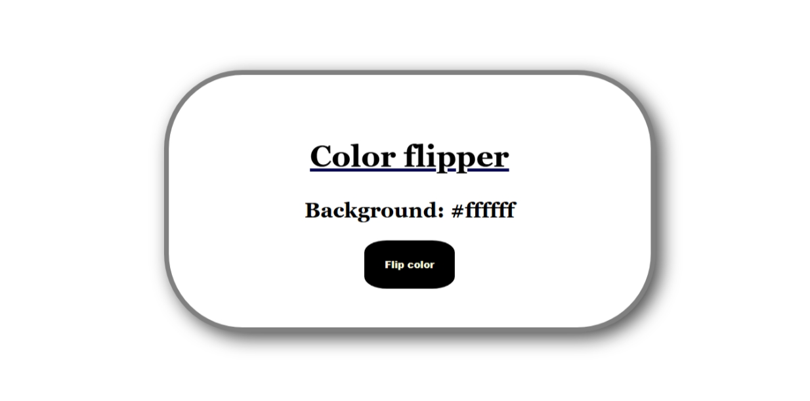
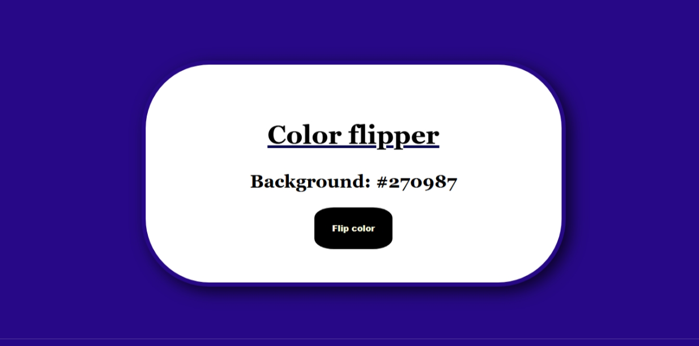

# 🎨 Color Flipper

simple web app that changes the background color to a random HEX color every time you click the button. Built using HTML, CSS, and JavaScript.

---

## 🔗 Live Demo

👉 [Click here to try it now](https://msdhinesh45.github.io/Color-Flipper/)  

---

## 🖼️ Output Screenshots

### 🌈 Output 1:

### 🎨 Output 2:

---

## 🚀 Features

- Click the button to change the background color
- HEX code is displayed on screen
- Stylish color display box
- Smooth UI with gradient backgrounds and border animations
- Fully responsive design for all devices

---

## 🛠️ Tech Stack

- HTML5  
- CSS3 (Flexbox, gradients, transitions)  
- JavaScript (DOM manipulation, HEX generation)

---

## 📦 How to Use Locally

1. Clone or download the repo.
2. Open the folder in your code editor.
3. Make sure all files (`index.html`, `style.css`, `script.js`) are in the same directory.
4. Open `index.html` in your browser.
5. Click the button and enjoy watching the background color change!

---

## 🙋 Author

**Dhinesh Kumar**  
B.Sc IT | M.Sc CS (Pursuing)  
🌐 GitHub: [@msdhinesh45](https://github.com/msdhinesh45)

---

## 📄 License

This project is open-source and free to use for learning or personal use. No license required.

---

✨ *Made with creativity and color magic!*
